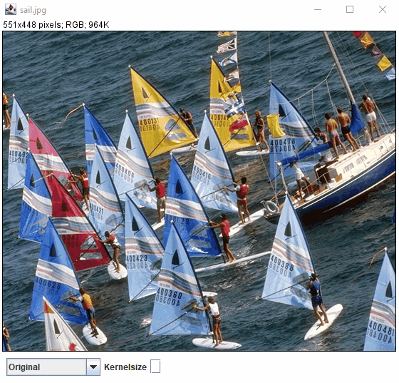

# GDM5
Filter masks, sharpen, blur and edges, 2nd semester, 5th exercise digital media

Goal here was to learn how to apply kernels to images, creating different effects
and apply multiple kernels consecutively.

